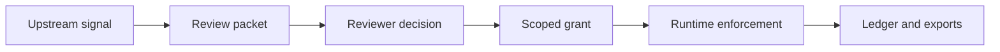

<div align="center">

<pre>
 ███████╗ ██████╗  ██████╗ ██████╗ ███████╗
 ██╔════╝██╔═══██╗██╔═══██╗██╔══██╗██╔════╝
 ███████╗██║   ██║██║   ██║██████╔╝█████╗
 ╚════██║██║   ██║██║   ██║██╔═══╝ ██╔══╝
 ███████║╚██████╔╝╚██████╔╝██║     ███████╗
 ╚══════╝ ╚═════╝  ╚═════╝ ╚═╝     ╚══════╝
</pre>

**Scoped authorization for AI-shaped scientific work**

[](https://github.com/fraware/SCOPE/releases)
[](LICENSE)
[](https://www.python.org/downloads/)
[](https://github.com/fraware/SCOPE/actions/workflows/ci.yml)

</div>

Repository: [https://github.com/fraware/SCOPE](https://github.com/fraware/SCOPE)

---

## Why SCOPE exists

When an AI system proposes a scientific action — updating a protocol, submitting to a robot queue, or publishing a claim — someone with the right expertise should review it before tools run. Most systems treat that as a checkbox. SCOPE treats it as a **structured workflow**: who reviewed, what they saw, what scope they approved, when it expires, and what happened at runtime.

SCOPE does **not** certify that an action is safe or correct. It produces auditable artifacts and enforces the scope a qualified reviewer actually approved.

## What SCOPE does

- Builds a **review packet** from upstream signals (what changed, what evidence exists, who should review)
- Captures a **typed reviewer decision** with rationale, role, and provenance
- Issues a **bounded grant** — allowed tools, scope, and expiration — tied to that decision
- **Enforces grants at runtime** and records violations, revocations, and expirations
- Maintains a **hash-chained ledger** for accountability and quality metrics
- **Exports** obligations and packaging artifacts for downstream runtimes (PF-Core, PCS)



> **Review is not a checkbox.** Review is a role, an artifact, a scope, an expiration, and an accountability trail.

---

## Quick start

Under two minutes from clone to a working review:

```bash
git clone https://github.com/fraware/SCOPE.git
cd SCOPE
pip install -e ".[dev]"
pytest
```

Run the bundled evaluation scenarios (8 core; add `--extended` for 13 more, 21 total):

```bash
python evals/run_review_cases.py
python evals/run_review_cases.py --extended
```

### AKTA one-shot review

The primary integration path when [AKTA](docs/akta_integration.md) flags an action for review: one command produces the packet, decision, grant, and summary.

```bash
scope akta review \
  --akta-trigger examples/protocol_drift/review_trigger.json \
  --akta-record examples/protocol_drift/akta_record.json \
  --grant-scope protocol_draft \
  --reviewer examples/protocol_drift/reviewer_protocol_owner.json \
  --decision-rationale "Narrow protocol draft approval only." \
  --out-dir ./out/akta_review
```

Outputs in `./out/akta_review/`:

| File | Purpose |
|------|---------|
| `scope_review_packet.json` | Artifacts and context for the reviewer |
| `scope_decision.json` | Structured approval with rationale |
| `scope_grant.json` | Runtime authorization bound to the decision |
| `summary.json` | One-line status for automation |

Full contract: [docs/akta_review_contract.md](docs/akta_review_contract.md). End-to-end demo: [docs/akta_scope_demo.md](docs/akta_scope_demo.md).

---

## Core workflows

### Review a request

Build and validate a packet from AKTA inputs, optionally enriched with a VSA scientific report:

```bash
scope packet create \
  --akta-record examples/protocol_change_review/akta_record.json \
  --akta-trigger examples/protocol_change_review/review_trigger.json \
  --out ./out/packet.json

scope packet validate ./out/packet.json
scope packet render ./out/packet.json --format markdown --out ./out/packet.md
```

For multi-reviewer cases, use review sessions (`scope review session …`) or the review queue (`scope review queue …`). See [docs/reviewer_guide.md](docs/reviewer_guide.md).

### Issue a grant

Submit a reviewer decision, then issue a grant from the approved scope:

```bash
scope decision submit \
  --packet ./out/packet.json \
  --reviewer examples/protocol_change_review/reviewer_protocol_owner.json \
  --decision examples/protocol_change_review/decision.json \
  --out ./out/decision.json

scope grant issue \
  --packet ./out/packet.json \
  --decision ./out/decision.json \
  --out ./out/grant.json
```

In production deployments, decisions must be cryptographically signed before grant issue. See [docs/trusted_boundary.md](docs/trusted_boundary.md) and [docs/key_management.md](docs/key_management.md).

### Check authorization at runtime

Before a tool executes, verify the grant still allows the requested action:

```bash
scope grant check \
  --grant ./out/grant.json \
  --requested-tool robot_queue.submit \
  --context examples/protocol_change_review/current_context.json \
  --ledger ./out/scope_events.jsonl
```

Returns `ALLOWED` or `BLOCKED`. Revoke or inspect status via `scope grant revoke` and `scope grant status`.

> For the complete CLI surface (export, quality, identity, policy overlays), run `scope --help` or see [docs/scoped_scientific_authorization.md](docs/scoped_scientific_authorization.md).

---

## Ecosystem

| Component | Role |
|-----------|------|
| **AKTA** | Classifies whether a scientific action needs review or authorization |
| **SCOPE** | Runs the review workflow and issues scoped grants |
| **PF-Core** | Runtime obligation verification from grant exports |
| **PCS** | Release packaging from packet, decision, and grant artifacts |
| **VSA** | Optional scientific report enrichment for review packets |

Integration field mappings: [docs/external_integration_contracts.md](docs/external_integration_contracts.md). Optional REST API: install with `pip install -e ".[rest]"` and run `uvicorn adapters.generic_rest.server:app`.

Institutional pilots: start with [docs/institutional_pilot_guide.md](docs/institutional_pilot_guide.md) and sample fixtures in [examples/institutional_pilot/](examples/institutional_pilot/).

---

## Documentation

| Document | Description |
|----------|-------------|
| [scoped_scientific_authorization.md](docs/scoped_scientific_authorization.md) | Protocol overview and doc index |
| [akta_review_contract.md](docs/akta_review_contract.md) | Frozen `scope akta review` output contract |
| [akta_integration.md](docs/akta_integration.md) | AKTA adapter and trigger mapping |
| [akta_scope_demo.md](docs/akta_scope_demo.md) | Full AKTA → SCOPE → PF → PCS walkthrough |
| [reviewer_guide.md](docs/reviewer_guide.md) | Reviewer role guidance |
| [review_doctrine.md](docs/review_doctrine.md) | Review principles and accountability |
| [institutional_pilot_guide.md](docs/institutional_pilot_guide.md) | Pilot workshop and lab checklist |
| [institutional_guide.md](docs/institutional_guide.md) | Institutional deployment overview |
| [trusted_boundary.md](docs/trusted_boundary.md) | Trust assumptions and production mode |
| [limitations.md](docs/limitations.md) | In-repo vs external boundaries |
| [identity_assurance.md](docs/identity_assurance.md) | Reviewer identity provenance |
| [signing_assurance.md](docs/signing_assurance.md) | Decision and grant signing provenance |
| [rbac_scope_authority.md](docs/rbac_scope_authority.md) | Org RBAC and scope policy checks |
| [key_management.md](docs/key_management.md) | Key registry and signing providers |
| [quality_metrics.md](docs/quality_metrics.md) | Ledger-backed review quality metrics |
| [threat_model.md](docs/threat_model.md) | Threats addressed and residual risk |
| [external_integration_contracts.md](docs/external_integration_contracts.md) | Cross-repo field mappings |
| [pf_core_bridge.md](docs/pf_core_bridge.md) | PF-Core obligation export |
| [pcs_export.md](docs/pcs_export.md) | PCS bundle export |
| [evidence_vocab_mapping.md](docs/evidence_vocab_mapping.md) | Evidence vocabulary alignment |
| [field_thesis.md](docs/field_thesis.md) | Design rationale |
| [CHANGELOG.md](CHANGELOG.md) | Release history |

---

## Contributing

Contributions are welcome — bug reports, docs improvements, adapters, and test coverage all help.

1. **Open an issue** to discuss larger changes: [GitHub Issues](https://github.com/fraware/SCOPE/issues)
2. **Fork, branch, and open a PR**: [GitHub Pull Requests](https://github.com/fraware/SCOPE/pulls)
3. **Run the same checks as CI** before submitting:

```bash
# Linux / macOS
bash scripts/ci.sh

# Windows
.\scripts\ci.ps1
```

CI runs on Python 3.10, 3.11, and 3.12: `ruff` lint, `mypy` typecheck, `pytest`, and all 21 evaluation scenarios with `--extended`.

Individual commands:

```bash
pip install -e ".[dev]"
ruff check scope tests evals adapters
mypy scope
pytest
python evals/run_review_cases.py --extended
```

### Repository layout

| Path | Contents |
|------|----------|
| `scope/` | Core protocol engine and CLI |
| `schemas/` | JSON schemas for artifacts |
| `policy/` | YAML policy bundles and domain overlays |
| `adapters/` | AKTA, VSA, PF-Core, PCS, and REST integrations |
| `examples/` | Scenario fixtures for docs and evals |
| `evals/` | 8 core + 13 extended evaluation scenarios |
| `tests/` | Pytest suite |
| `docs/` | Protocol and integration documentation |

### Python API

```python
from scope import ScopeEngine

engine = ScopeEngine.from_policy_dir("policy/", ledger_path="logs/scope_events.jsonl")
packet = engine.create_packet(
    "examples/protocol_change_review/akta_record.json",
    "examples/protocol_change_review/review_trigger.json",
)
decision = engine.submit_decision(
    packet,
    {"reviewer_id": "r1", "role": "protocol_owner"},
    {
        "type": "approve_narrower_scope",
        "approved_scope": "protocol_draft",
        "rationale": "Evidence supports validation draft only.",
    },
)
grant = engine.issue_grant(packet, decision)
allowed = engine.check_grant_detailed(
    grant, "protocol_editor.draft_change", {"protocol_version": "protocol_v3"}
)
```

---

## For integrators

Technical reference for assurance models, production mode, and cross-repo contracts:

| Topic | Document |
|-------|----------|
| Identity assurance levels (IAL0–IAL4) | [identity_assurance.md](docs/identity_assurance.md) |
| Signing assurance levels (SAL0–SAL4) | [signing_assurance.md](docs/signing_assurance.md) |
| Two-stage authority checks | [rbac_scope_authority.md](docs/rbac_scope_authority.md) |
| Production mode and signing | [trusted_boundary.md](docs/trusted_boundary.md) |
| REST API (`POST /v0/akta/review`, grant check, queue) | [external_integration_contracts.md](docs/external_integration_contracts.md) |
| PF obligation and PCS manifest formats | [pf_core_bridge.md](docs/pf_core_bridge.md), [pcs_export.md](docs/pcs_export.md) |

Environment variables for production (OIDC identity, ledger delivery, signing keys) are documented in [docs/trusted_boundary.md](docs/trusted_boundary.md) and [docs/institutional_pilot_guide.md](docs/institutional_pilot_guide.md).

---

## License

MIT — see [LICENSE](LICENSE).
