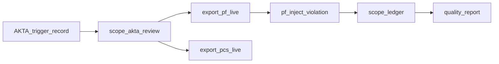

# Live Ecosystem Demo (AKTA → SCOPE → PF → PCS)

This document describes the **live** cross-repo authorization loop using sibling repositories and optional REST triggers. For fixture-only walkthroughs, see [akta_scope_demo.md](akta_scope_demo.md).

Related: [external_integration_contracts.md](external_integration_contracts.md), [pf_core_bridge.md](pf_core_bridge.md), [pcs_export.md](pcs_export.md).

## Prerequisites

```powershell
pip install -e ".[dev]"
```

Configure partner repo paths (local checkouts):

| Variable | Purpose |
|----------|---------|
| `AKTA_REPO_PATH` | AKTA runtime checkout (optional; demo uses bundled fixtures) |
| `PF_CORE_REPO_PATH` | PF-Core validator for `--live` PF export |
| `PCS_CORE_REPO_PATH` | PCS validator for `--live` PCS export |
| `SCOPE_REST_URL` | SCOPE REST base URL when using REST trigger (default `http://127.0.0.1:8765`) |
| `SCOPE_API_KEY` | Bearer token when REST auth is enabled |

## One-command demo

**Linux / macOS:**

```bash
export PF_CORE_REPO_PATH=/path/to/pf-core   # optional live validation
export PCS_CORE_REPO_PATH=/path/to/pcs-core
bash scripts/ecosystem_demo.sh
```

**Windows (PowerShell):**

```powershell
$env:PF_CORE_REPO_PATH = "C:\path\to\pf-core"
$env:PCS_CORE_REPO_PATH = "C:\path\to\pcs-core"
.\scripts\ecosystem_demo.ps1
```

Output directory defaults to `/tmp/scope_ecosystem_demo` (Linux) or `%TEMP%\scope_ecosystem_demo` (Windows).

## Demo flow



1. **AKTA → SCOPE** — `scope akta review` (CLI) or `scripts/akta_rest_review.py` (REST)
2. **SCOPE → PF** — `scope export pf --validate --live`
3. **PF violation loop** — `scripts/pf_inject_violation.py` simulates a blocked tool call and records `runtime_scope_violation`
4. **SCOPE → PCS** — `scope export pcs --validate --live`
5. **Quality metrics** — `scope quality report` with non-zero `post_approval_runtime_violation_rate`

## REST trigger path

Start the REST server:

```bash
uvicorn adapters.generic_rest.server:app --host 127.0.0.1 --port 8765
```

Run demo with REST:

```bash
USE_REST=true SCOPE_REST_URL=http://127.0.0.1:8765 bash scripts/ecosystem_demo.sh
```

Or call the AKTA wrapper directly:

```bash
python scripts/akta_rest_review.py \
  --akta-record examples/protocol_drift/akta_record.json \
  --akta-trigger examples/protocol_drift/review_trigger.json \
  --reviewer examples/protocol_drift/reviewer_protocol_owner.json \
  --grant-scope protocol_draft \
  --decision-rationale "REST demo approval" \
  --out-dir /tmp/akta_rest_out
```

## Session-complete path

Multi-role demo with votes manifest:

```bash
scope akta review \
  --akta-record examples/pilot/multi_role_genomics_review/akta_record.json \
  --akta-trigger examples/pilot/multi_role_genomics_review/review_trigger.json \
  --session-complete \
  --votes examples/pilot/multi_role_genomics_review/votes.json \
  --grant-scope genomics_analysis \
  --out-dir /tmp/multi_role_demo
```

REST equivalent: pass `--session-complete` and `--votes` to `scripts/akta_rest_review.py`.

## VSA scheduled re-fetch

Evidence downgrade can trigger grant expiration via existing expiration rules. Schedule periodic VSA re-fetch:

```python
from adapters.vsa.fetch_report import schedule_vsa_refetch

schedule_vsa_refetch(
    report_id="VSA-REPORT-001",
    interval_seconds=3600,
    on_refresh=lambda report: print(report["evidence_summary"]),
)
```

Or run the CLI hook:

```bash
python -m adapters.vsa.fetch_report --report-id VSA-REPORT-001 --interval 3600 --once
```

Set `VSA_API_URL` and `VSA_API_TOKEN` for live fetches.

## Acceptance criteria

- One command runs the full loop locally
- `post_approval_runtime_violation_rate` > 0 after PF inject
- PF/PCS live validators pass when repo paths are set
- Skips explicitly when paths absent (default CI remains green)

## CI

Optional `live-ecosystem` job in `.github/workflows/ci.yml` runs when repository variables are configured. See [CONTRIBUTING.md](../CONTRIBUTING.md).
