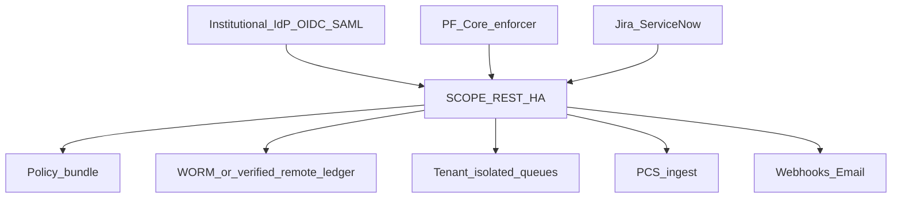

# Production Deployment Guide

Reference architecture for institutional SCOPE deployments (v0.11+).

Related: [trusted_boundary.md](trusted_boundary.md), [key_management.md](key_management.md), [identity_assurance.md](identity_assurance.md).

## Topology



| Component | Role |
|-----------|------|
| IdP | OIDC/SAML identity; SCIM snapshot sync via `scope rbac sync` |
| SCOPE REST | FastAPI server (`uvicorn adapters.generic_rest.server:app`) |
| Ledger | Local JSONL + optional WORM (`SCOPE_LEDGER_WORM_PATH`) or verified remote |
| PF enforcer | Sidecar consuming PF obligations; POSTs violations to `/v0/ledger/violations` |
| PCS ingest | Validates PCS bundles from `scope export pcs --live` |
| Notifications | Webhook/email on SLA breach |

## Environment checklist

| Variable | Purpose |
|----------|---------|
| `SCOPE_PRODUCTION_MODE` | Fail-closed signing and IAL enforcement |
| `SCOPE_API_KEY` | REST bearer authentication |
| `SCOPE_OIDC_*` | OIDC identity verification |
| `SCOPE_KMS_REFERENCE_KEY_PATH` or `SCOPE_KMS_ENDPOINT` | SAL4 signing |
| `SCOPE_LEDGER_DELIVERY_MODE` | `fail_closed` for high-risk grants |
| `SCOPE_LEDGER_WORM_PATH` | WORM-emulation sink |
| `SCOPE_LEDGER_VERIFIED_REMOTE` | Require Merkle/signed remote ack |
| `SCOPE_TENANT_ID` / `X-Scope-Tenant-Id` | Queue namespace isolation |
| `SCOPE_NOTIFY_WEBHOOK_URL` | Escalation notifications |
| `SCOPE_REST_AUDIT` | REST request audit events (default on) |

## Hardening

- Terminate TLS at load balancer; never expose signing keys to REST clients
- Rotate `SCOPE_API_KEY` per environment
- Rate-limit REST endpoints at reverse proxy
- Protect queue and session directories with filesystem ACLs
- Run `scope rbac sync --source scim` on directory change schedule
- Monitor `ledger_delivery_failure_count` in quality reports

## HA reference

- Run multiple REST replicas behind load balancer with shared read-only policy mount
- Use institutional WORM or verified remote ledger for authoritative audit trail
- Spool mode (`at_least_once`) for transient remote ledger outages
- Per-tenant queue directories under `.scope/queues/{tenant_id}/`

## Startup

```bash
export SCOPE_PRODUCTION_MODE=true
export SCOPE_API_KEY=...
export SCOPE_LEDGER_DELIVERY_MODE=fail_closed
uvicorn adapters.generic_rest.server:app --host 0.0.0.0 --port 8080 --workers 4
```

## Verification

```bash
scope quality report --ledger /var/scope/ledger.jsonl --out /tmp/quality.json
python scripts/verify_pilot_fixtures.py
python scripts/verify_ledger_chain.py /var/scope/ledger.jsonl
```
